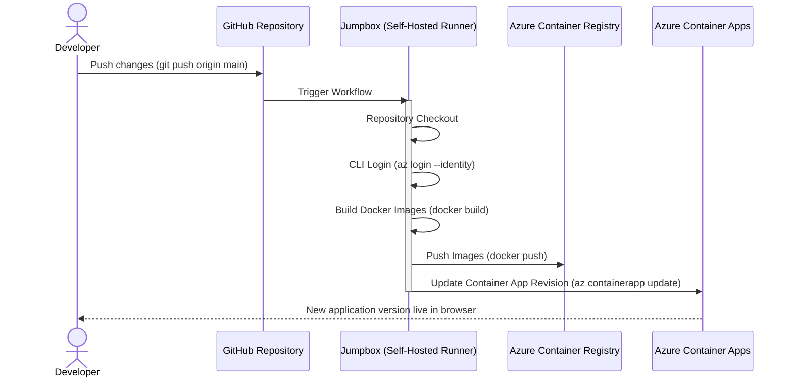

Cloud Infrastructure Documentation (Azure Serverless & Cloud-Native)

## 1. Introduction and Solution Architecture

The goal of this project is to modernize and migrate two independent, on-premises application systems to the Microsoft Azure public cloud. The architecture was designed based on the Cloud-Native and Serverless paradigms, ensuring high scalability, security based on managed identities (Zero Trust), and full deployment automation (CI/CD) using Terraform (Infrastructure as Code).

### Application Context

The infrastructure supports two technologically diverse projects, which necessitated the use of flexible deployment patterns in the container orchestration layer:

| Feature | GymCore Project | GameNest Project |
| :--- | :--- | :--- |
| **Architecture** | Decoupled (Multi-tier) | Monolith with a Decoupled Web Server |
| **Backend** | .NET (C#) REST API | PHP 8.3 (PHP-FPM) |
| **Frontend** | React.js (Vite) | Server-side rendering (HTML/CSS/JS) |
| **Deployment Pattern** | Independent microservices (Frontend + API) | **Sidecar** Pattern (NGINX + PHP in a single Pod) |
| **Integration Challenges** | Dynamic CORS configuration, variable injection during frontend build | Shared network support (localhost), static file serving, automatic database seeding |

### Core Infrastructure Components (Azure Cloud)

The solution is based on fully managed services (PaaS), eliminating the need to maintain underlying operating systems (apart from an isolated deployment management machine).

* **Azure Container Apps (ACA):** The primary runtime for Docker containers. This service provides serverless scaling (from 0 replicas) based on HTTP requests. It was used to host the GymCore API, the GymCore frontend, and the GameNest application (using the Sidecar pattern for NGINX and PHP).
* **Azure Database for PostgreSQL Flexible Server:** A relational database providing a persistence layer for both systems. Configured with network isolation, it requires secure connections (SSL) and is automatically initialized when the application first starts.
* **Azure Key Vault:** A centralized, highly secure store for keys, certificates, and credentials (e.g., database connection strings).
* **Azure Container Registry (ACR):** A private container image registry from which Container Apps retrieves built deployment packages. * **Managed Network (VNET):** A defined network topology divided into subnets (Subnets) for applications, databases, and access services. All protected by Network Security Groups (NSGs).
* **Azure Bastion & Jumpbox (Self-Hosted Runner):** A virtual machine located in a secure subnet, accessible exclusively through the Azure Bastion service. It serves a dual role: as a host for the GitHub Actions runtime (supporting CI/CD processes) and as an administrative point for managing the internal infrastructure.
* **Managed Identities:** An authentication system based on managed identities (User-Assigned), eliminating the need to pass explicit passwords between services (e.g., ACR and Container Apps, Container Apps and Key Vault).

## 2. Architecture and Data Flow (Diagrams)

The following architectural diagrams were generated using Mermaid syntax and illustrate the physical and logical separation of resources, as well as the automated deployment processes used in the project.

### 2.1. Network Topology and Environment Separation (Network Architecture)

The Azure cloud infrastructure was designed based on a multi-tier virtual network (VNET) model. Application services (Azure Container Apps) run in an isolated runtime environment. Access to the database layer is completely isolated from the public internet, and the architecture is managed via the highly secure Azure Bastion service and the Jumpbox machine.

```mermaid
TD flowchart 
    Internet((Public Internet)) 
    
    subgraph AzureCloud [Microsoft Azure Cloud] 
        directionTB 
    
        subgraph VNET [Virtual Network - VNET] 
            directionTB 
    
            subgraph BastionSubnet [AzureBastionSubnet] 
                Bastion[Azure Bastion] 
            end 
    
            subgraph JumpboxSubnet [Management Subnet] 
                Jumpbox[Jumpbox Machine / Self-Hosted Runner] 
            end 
    
            subgraph AppSubnet [Application Subnet - ACA Environment] 
                ACA_Front[GymCore Frontend] 
                ACA_API[GymCore REST API] 
                ACA_GameNest[GameNest NGINX + PHP] 
            end 
    
            subgraph DBSubnet [Database Subnet] 
                PostgreSQL[(Azure DB for PostgreSQL\nFlexible Server)] 
            end
        end
    
        ACR [Azure Container Registry]
        KV [Azure Key Vault]
    end
    
    Internet -->|HTTPS / 443| ACA_Front
    Internet -->|HTTPS / 443| ACA_API
    Internet -->|HTTPS / 443| ACA_GameNest
    Internet -->|HTTPS / 443| Bastion
    
    Bastion -->|SSH| Jumpbox
    Jumpbox -->|Code Deployment| AppSubnet
    Jumpbox -->|Database Management| PostgreSQL
    
    ACA_API -->|Read/Write| PostgreSQL
    ACA_GameNest -->|Read/Write| PostgreSQL
    
    AppSubnet -.->|Downloading Docker Images| ACR
    AppSubnet -.->|Downloading Secrets (Managed Identity)| KV
```

### 2.2. Sidecar Architecture for the GameNest Application

The GameNest application (built in PHP) required adaptation to a cloud serverless environment. The Sidecar deployment pattern was utilized, where two containers run within the same instance (Replica/Pod) in Azure Container Apps, sharing the same network space (`localhost`). The NGINX container handles serving static files and routing dynamic requests to the PHP-FPM process, resolving the lack of a native HTTP server within the PHP image itself.

```mermaid
flowchart LR
    Client((User))
    
    subgraph ACA [Azure Container App: app-gamenest-dev]
        direction TB
        
        subgraph Pod [Shared Network Space / Replica]
            direction LR
            Nginx[NGINX Container\n(Port: 80)]
            PHP[PHP-FPM Container\n(Port: 9000)]
        end
        
        StaticAssets[(Static Assets\n/app/public/)]
    end
    
    DB[(Azure PostgreSQL)]

    Client -->|HTTP Request| Nginx
    Nginx -->|Request Assets (.css, .js, .jpg)| StaticAssets
    Nginx -->|Pass Script (.php)\nfastcgi_pass 127.0.0.1:9000| PHP
    PHP -->|PDO + SSL Connection| DB
    
    style Nginx fill:#009639,stroke:#fff,stroke-width:2px,color:#fff
    style PHP fill:#4F5D95,stroke:#fff,stroke-width:2px,color:#fff
```

### 2.3. Continuous Integration and Deployment Pipeline Flow (CI/CD)

Deployments are fully automated using GitHub Actions. To prevent transmitting sensitive cloud credentials through external third-party servers, actions are executed directly on a dedicated management virtual machine (Jumpbox) operating as a **Self-Hosted Runner**. The machine authenticates to Azure via Managed Identity (Zero Trust model), compiles Docker images, pushes them to the Azure Container Registry (ACR), and forces a new revision update in Azure Container Apps.



