# Cloud Infrastructure Documentation

<p>
    
    
    
    
    
    
    
    
</p>

## Table of Contents
1. [Introduction and Solution Architecture](#1-introduction-and-solution-architecture)
2. [Architecture and Data Flow (Diagrams)](#2-architecture-and-data-flow-diagrams)
3. [Infrastructure as Code (Terraform Structure)](#3-infrastructure-as-code-terraform-structure)
4. [Engineering Challenges & Solved Problems](#4-engineering-challenges--solved-problems)
5. [Step-by-Step Deployment Guide](#5-step-by-step-deployment-guide)
6. [Infrastructure Proof of Execution (Visual Roadmap)](#6-infrastructure-proof-of-execution-visual-roadmap)
7. [Environment Lifecycle & Cost Management (FinOps)](#7-environment-lifecycle--cost-management-finops)

---

## 1. Introduction and Solution Architecture

The goal of this project is to modernize and migrate two independent, on-premises application systems to the Microsoft Azure public cloud. The architecture was designed based on the Cloud-Native and Serverless paradigms, ensuring high scalability, security based on managed identities (Zero Trust), and full deployment automation (CI/CD) using Terraform (Infrastructure as Code).

### Application Context

The infrastructure supports two technologically diverse projects, which necessitated the use of flexible deployment patterns in the container orchestration layer:

| Feature | GymCore Project | GameNest Project |
| :--- | :--- | :--- |
| **Architecture** | Decoupled (Multi-tier) | Monolith with a Decoupled Web Server |
| **Backend** | .NET (C#) REST API | PHP 8.3 (PHP-FPM) |
| **Frontend** | React.js (Vite) | Server-side rendering (HTML/CSS/JS) |
| **Deployment Pattern** | Independent microservices (Frontend + API) | **Sidecar** Pattern (NGINX + PHP in a single Pod) |
| **Integration Challenges** | Dynamic CORS configuration, variable injection during frontend build | Shared network support (localhost), static file serving, automatic database seeding |

### Core Infrastructure Components (Azure Cloud)

The solution is based on fully managed services (PaaS), eliminating the need to maintain underlying operating systems (apart from an isolated deployment management machine).

* **Azure Container Apps (ACA):** The primary runtime for Docker containers. This service provides serverless scaling (from 0 replicas) based on HTTP requests. It was used to host the GymCore API, the GymCore frontend, and the GameNest application (using the Sidecar pattern for NGINX and PHP).
* **Azure Database for PostgreSQL Flexible Server:** A relational database providing a persistence layer for both systems. Configured with network isolation, it requires secure connections (SSL) and is automatically initialized when the application first starts.
* **Azure Key Vault:** A centralized, highly secure store for keys, certificates, and credentials (e.g., database connection strings).
* **Azure Container Registry (ACR):** A private container image registry from which Container Apps retrieves built deployment packages. * **Managed Network (VNET):** A defined network topology divided into subnets (Subnets) for applications, databases, and access services. All protected by Network Security Groups (NSGs).
* **Azure Bastion & Jumpbox (Self-Hosted Runner):** A virtual machine located in a secure subnet, accessible exclusively through the Azure Bastion service. It serves a dual role: as a host for the GitHub Actions runtime (supporting CI/CD processes) and as an administrative point for managing the internal infrastructure.
* **Managed Identities:** An authentication system based on managed identities (User-Assigned), eliminating the need to pass explicit passwords between services (e.g., ACR and Container Apps, Container Apps and Key Vault).

## 2. Architecture and Data Flow (Diagrams)

The following architectural diagrams were generated using Mermaid syntax and illustrate the physical and logical separation of resources, as well as the automated deployment processes used in the project.

### 2.1. Network Topology and Environment Separation (Network Architecture)

The Azure cloud infrastructure was designed based on a multi-tier virtual network (VNET) model. Application services (Azure Container Apps) run in an isolated runtime environment. Access to the database layer is completely isolated from the public internet, and the architecture is managed via the highly secure Azure Bastion service and the Jumpbox machine.

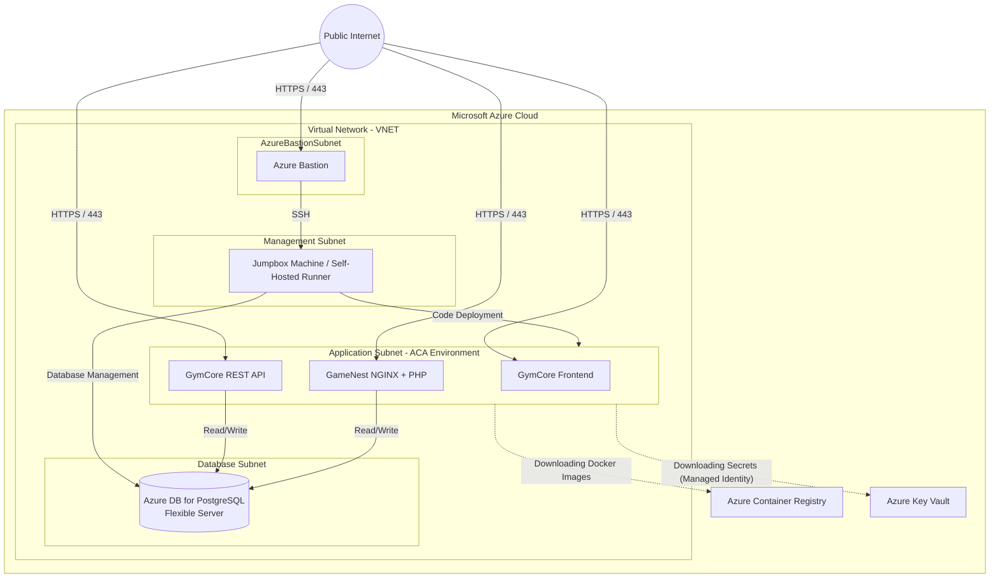

### 2.2. Sidecar Architecture for the GameNest Application

The GameNest application (built in PHP) required adaptation to a cloud serverless environment. The Sidecar deployment pattern was utilized, where two containers run within the same instance (Replica/Pod) in Azure Container Apps, sharing the same network space (`localhost`). The NGINX container handles serving static files and routing dynamic requests to the PHP-FPM process, resolving the lack of a native HTTP server within the PHP image itself.

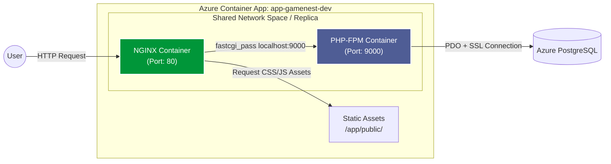

### 2.3. Continuous Integration and Deployment Pipeline Flow (CI/CD)

Deployments are fully automated using GitHub Actions. To prevent transmitting sensitive cloud credentials through external third-party servers, actions are executed directly on a dedicated management virtual machine (Jumpbox) operating as a **Self-Hosted Runner**. The machine authenticates to Azure via Managed Identity (Zero Trust model), compiles Docker images, pushes them to the Azure Container Registry (ACR), and forces a new revision update in Azure Container Apps.

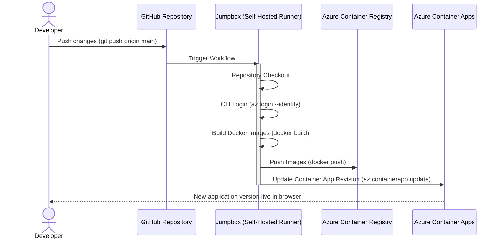

## 3. Infrastructure as Code (Terraform Structure)

The infrastructure provisioning is fully automated using Terraform. To ensure maintainability, scalability, and strict adherence to the **DRY (Don't Repeat Yourself)** principle, the codebase is designed with enterprise-grade modularity.

By separating the resource definitions (modules) from the environment-specific configurations (environments), the architecture allows for rapid, secure, and highly consistent deployments across multiple stages (e.g., Development, Staging, Production).

### Logical Layering

The infrastructure is logically divided into four functional tiers, ensuring that dependencies are resolved sequentially and securely:

1. **Foundation (Shared):** The underlying network, security, and registry components.
2. **Storage (Database):** The persistence layer, isolated from the public internet.
3. **Runtime (Apps):** The containerized application layer, relying on the foundation and storage.
4. **Orchestration (Env):** The environment-specific implementation that binds the above layers together using specific parameters.

### Directory Layout

The repository follows a clean and structured hierarchy to reflect the logical layering:

```text
.
├── modules/
│   ├── apps/               # Containerized application workloads
│   │   ├── gamenest.tf         # Sidecar pattern definition (NGINX + PHP-FPM)
│   │   ├── gymcore_api.tf      # GymCore .NET REST API
│   │   ├── gymcore_frontend.tf # GymCore React.js Frontend
│   │   └── iam_and_secrets.tf  # Managed Identities and Key Vault integrations
│   │
│   ├── compute/            # Computational resources
│   │   └── main.tf             # Definitions for Virtual Machines (e.g., Jumpbox)
│   │
│   ├── database/           # Data persistence layer
│   │   └── main.tf             # Azure Database for PostgreSQL Flexible Server
│   │
│   └── shared/             # Foundational infrastructure components
│       ├── acr.tf              # Azure Container Registry
│       ├── bastion.tf          # Azure Bastion for secure VM access
│       ├── identity.tf         # User-Assigned Managed Identities
│       ├── keyvault.tf         # Azure Key Vault for secrets management
│       ├── log_analytics.tf    # Monitoring and logging workspaces
│       └── network.tf          # VNET, Subnets, and Network Security Groups (NSG)
│
├── env/
│   ├── dev/                # Development Environment Configuration
│   │   ├── main.tf             # Calls the modules with Dev-specific parameters
│   │   ├── providers.tf        # Azure Provider and remote backend configuration
│   │   ├── terraform.tfvars    # Variable values (SKUs, naming conventions)
│   │   └── variables.tf        # Environment variable declarations
│   │
│   └── prod/               # Production Environment Configuration (Analogous to Dev)
│
└── scripts/
    └── bootstrap-state.sh  # Shell script to provision Azure Storage Account for remote tfstate
```

*Note: Each directory within /modules also contains dedicated variables.tf (input parameters) and outputs.tf (exported values for cross-module referencing).*

### The Power of Modularity and the DRY Principle
This structural approach offers significant engineering advantages:

- **Centralized Logic**: Resource configurations (like the Sidecar setup for GameNest or VNET peering) are written exactly once in the `/modules` directory. If a baseline security rule needs updating, it is changed in one place, automatically propagating to all environments upon the next application.

- **Environment Replication**: Spinning up a completely new environment (e.g., `QA` or `UAT`) requires zero code duplication. It is achieved simply by copying the `/env/dev` folder, renaming it to `/env/qa`, and adjusting the SKU sizes or instance counts in the `terraform.tfvars` file.

- **State Isolation**: Each environment maintains its own Terraform state file (`.tfstate`) in the remote Azure Storage backend. This guarantees that changes or potential failures in the Development environment have absolutely zero impact on Production.

## 4. Engineering Challenges & Solved Problems

Migrating legacy on-premises applications to a fully managed, serverless cloud environment introduced several complex architectural and operational challenges. This section highlights the technical pitfalls encountered and the engineering strategies implemented to overcome them, demonstrating a deep understanding of Cloud-Native paradigms.

### 4.1. Terraform State vs. CI/CD Pipeline Conflicts
* **The Challenge:** Azure Container Apps require a container image to be specified upon creation. However, continuous deployment via GitHub Actions updates the image tags dynamically. Running `terraform apply` subsequently would detect a state drift and attempt to overwrite the CI/CD-deployed image with the older base image defined in the infrastructure code, effectively destroying live deployments.
* **The Solution:** Implemented the `lifecycle { ignore_changes = [template[0].container] }` block within the Terraform AzureRM provider. This crucial decoupling ensures that Terraform solely manages the underlying infrastructure constraints (CPU, memory, networking) while yielding the authority over the application state (image versions and environment variables) entirely to the GitHub Actions CI/CD pipelines.

### 4.2. Dynamic FQDNs, CORS, and Build-Time Injection (Vite & .NET)
* **The Challenge:** Azure Container Apps generate dynamic, non-deterministic Fully Qualified Domain Names (FQDNs) containing random hashes. This made it impossible to hardcode API endpoints in the React frontend or configure static CORS origins in the .NET backend.
* **The Solution:**
    * **Backend (.NET):** Configured a dynamic CORS policy utilizing `SetIsOriginAllowed(origin => origin.EndsWith(".azurecontainerapps.io"))`, securely allowing cross-origin requests from any dynamically generated ACA frontend environment.
    * **Frontend (React/Vite):** Engineered a dynamic build step in the GitHub Actions runner. The pipeline queries the Azure CLI (`az containerapp show`) to extract the newly generated backend API FQDN in real-time, injecting it directly into the `.env` file before executing `npm run build`.

### 4.3. Sidecar Networking & Static Asset Delivery (NGINX + PHP)
* **The Challenge:** Adapting a traditional PHP monolithic structure to a containerized environment resulted in `502 Bad Gateway` and `404 Not Found` errors. NGINX could not reach PHP, and static assets (CSS/JS) were missing from the web server response.
* **The Solution:** Fully leveraged the ACA **Sidecar** pattern capabilities.
    * **Networking:** Configured the NGINX `fastcgi_pass` directive to target `127.0.0.1:9000` instead of a container hostname, capitalizing on the fact that sidecar containers in ACA share the same local network namespace.
    * **Asset Delivery:** Modified the NGINX `Dockerfile` to independently copy the `/public` directory into its own image. This decoupled the static asset serving from the PHP container, optimizing performance and eliminating 404 routing errors.

### 4.4. Robust Cloud Database Seeding & Complex SQL Execution
* **The Challenge:** The application required an automated database initialization on its first run in the cloud. Attempting to execute the `init.sql` file via PHP's `$pdo->exec()` failed silently or caused `500 Internal Server Errors` because standard PDO drivers struggle to parse large, multi-statement dumps containing complex PL/pgSQL functions and triggers.
* **The Solution:** Shifted the database initialization responsibility to the container's startup sequence. Installed the native `postgresql-client` in the Alpine image and engineered the `entrypoint.sh` script to query the database state (`SELECT TO_REGCLASS(...)`). If the database is empty, the script securely executes the `init.sql` file via the native `psql` command-line tool before starting the PHP-FPM process.
* **Docker Context Trap:** Identified and resolved a subtle deployment bug where the initialization script was missing in the cloud due to a broad `.dockerignore` rule. Fixed by explicitly whitelisting the file (`!db/init/init.sql`), ensuring flawless cloud seeding.

### 4.5. Cross-Platform Execution Traps (Windows to Alpine Linux)
* **The Challenge:** Shell scripts (`entrypoint.sh`) authored or checked out on Windows environments inherited `CRLF` (Carriage Return Line Feed) line endings. When executed inside the strict Linux Alpine container, the OS kernel threw an `exec format error` (`/bin/sh^M: bad interpreter`), causing the container to crash immediately upon startup.
* **The Solution:** Implemented aggressive formatting normalization directly within the `Dockerfile`. Utilized `RUN sed -i 's/\r$//' /entrypoint.sh` to strip Windows carriage returns during the image build process. Furthermore, explicitly declared `ENTRYPOINT ["sh", "/entrypoint.sh"]` to bypass shebang (`#!`) parsing issues entirely, guaranteeing bulletproof container startups regardless of the developer's host operating system.

## 5. Step-by-Step Deployment Guide

This section provides a comprehensive, highly detailed playbook for replicating the entire infrastructure from scratch. The process spans from initial cloud authentication to the final execution of the CI/CD pipelines on isolated, self-hosted runners.

### Step 1: Prerequisites & Authentication

Before executing any infrastructure code, ensure your local development environment meets the following requirements:

* **Azure Subscription:** An active Microsoft Azure subscription.
* **IAM Permissions:** The executing user/service principal must possess the **Contributor** role (to create resources) and the **User Access Administrator** role (to grant RBAC permissions to Managed Identities).
* **CLI Tools:**
    * [Terraform](https://developer.hashicorp.com/terraform/downloads) (v1.5.0 or newer)
    * [Azure CLI](https://learn.microsoft.com/en-us/cli/azure/install-azure-cli) (`az`)
* **Authentication:** Authenticate your local Azure CLI session:
  ```bash
  az login
  az account set --subscription "<YOUR_SUBSCRIPTION_ID>"
  ```

### Step 2: Remote State Initialization (Bootstrap)
To ensure team collaboration and prevent state corruption, Terraform state must be stored in a remote, encrypted Azure Storage Account.

1. Navigate to the root directory of the project.
2. Execute the bootstrap script to provision the necessary resource group, storage account, and blob container:

   ```bash
   chmod +x scripts/bootstrap-state.sh
   ./scripts/bootstrap-state.sh
   ```

3. The script will output the storage account details. Update the `backend "azurerm"` block inside `env/dev/providers.tf` with the generated values:

   ```hcl
   backend "azurerm" {
     resource_group_name  = "rg-terraform-state"
     storage_account_name = "sttfstate<random_hash>"
     container_name       = "tfstate"
     key                  = "dev.terraform.tfstate"
   }
   ```

**Security Note:** Pass the Storage Account Access Key via the `ARM_ACCESS_KEY` environment variable rather than hardcoding it in the configuration files.

### Step 3: Infrastructure Provisioning
With the remote state configured, proceed to provision the foundational network, databases, registries, and compute resources.

1. Navigate to the target environment directory:
   ```bash
   cd env/dev
   ```
2. Initialize the Terraform workspace and download required provider plugins:
   ```bash
   terraform init
   ```
3. Generate an execution plan to verify the resources that will be created:
   ```bash
   terraform plan -out=infrastructure.tfplan
   ```
4. Apply the execution plan to provision the Azure resources (this process typically takes 10-15 minutes):
   ```bash
   terraform apply infrastructure.tfplan
   ```

### Step 4: Jumpbox & Self-Hosted Runner Configuration
Once Terraform completes, the Virtual Network (VNET) and the isolated Jumpbox Virtual Machine are provisioned. The next step is to configure this VM as the execution environment for GitHub Actions.

*   **Secure Connection:** Navigate to the Azure Portal, locate your Jumpbox VM, and connect to it using Azure Bastion (HTML5 SSH client via browser). Use the SSH credentials defined in your `terraform.tfvars`.
*   **Install Runtime Dependencies:** Once connected to the Linux terminal, install the required packages (Docker and Azure CLI):

    ```bash
    # Update system and install prerequisites
    sudo apt-get update -y && sudo apt-get upgrade -y
    sudo apt-get install -y curl jq build-essential libssl-dev libffi-dev python3-venv

    # Install Docker Engine
    curl -fsSL https://get.docker.com -o get-docker.sh
    sudo sh get-docker.sh
    sudo usermod -aG docker $USER

    # Install Azure CLI
    curl -sL https://aka.ms/InstallAzureCLIDeb | sudo bash
    ```

*   **Configure Isolated GitHub Actions Runners:** To handle deployments for both applications concurrently without workspace conflicts, set up two distinct runner instances.

    ```bash
    # Create isolated directories
    mkdir -p ~/actions-runner-gymcore ~/actions-runner-gamenest
    ```

    **GymCore Runner Configuration:**
    ```bash
    cd ~/actions-runner-gymcore
    curl -o actions-runner-linux-x64.tar.gz -L https://github.com/actions/runner/releases/download/v2.316.1/actions-runner-linux-x64-2.316.1.tar.gz
    tar xzf ./actions-runner-linux-x64.tar.gz
    ./config.sh --url https://github.com/<YOUR_USER>/<GYMCORE_REPO> --token <GITHUB_RUNNER_TOKEN_1> --name "jumpbox-gymcore" --unattended
    sudo ./svc.sh install
    sudo ./svc.sh start
    ```

    **GameNest Runner Configuration:**
    ```bash
    cd ~/actions-runner-gamenest
    curl -o actions-runner-linux-x64.tar.gz -L https://github.com/actions/runner/releases/download/v2.316.1/actions-runner-linux-x64-2.316.1.tar.gz
    tar xzf ./actions-runner-linux-x64.tar.gz
    ./config.sh --url https://github.com/<YOUR_USER>/<GAMENEST_REPO> --token <GITHUB_RUNNER_TOKEN_2> --name "jumpbox-gamenest" --unattended
    sudo ./svc.sh install
    sudo ./svc.sh start
    ```

### Step 5: CI/CD Pipeline Execution & Application Deployment

*Prerequisite: Ensure you have forked the source repositories to your own GitHub account. You cannot trigger deployments or register runners against the original source repositories due to lack of write permissions.*

With the infrastructure running and the Self-Hosted Runners reporting as "Online" in the GitHub repository settings, the final step is to deploy the applications.

1. Navigate to the **Actions** tab in your GitHub repositories (for both GymCore and GameNest).
2. Manually trigger the deployment workflows by selecting the workflow and clicking **Run workflow** (or simply execute a `git push origin main` if triggers are set on the main branch).

**Pipeline Execution Sequence:**
1. The Jumpbox runner intercepts the job.
2. It logs into Azure securely using the assigned Managed Identity (`az login --identity`).
3. For the GymCore frontend, it queries the Azure CLI to dynamically retrieve the API's FQDN and generates the `.env` file on the fly.
4. Docker Engine on the Jumpbox builds the application images.
5. The images are pushed to the private Azure Container Registry (ACR).
6. Finally, the pipeline issues an `az containerapp update` command, forcing the Azure Container Apps environment to pull the new images and roll out the latest revision.

**Verification:** Once the pipelines succeed, retrieve the Application FQDNs from the Azure Portal and navigate to them in your browser to verify the secure HTTPS connection, the Sidecar operational status, and successful database connectivity.

## 6. Infrastructure Proof of Execution (Visual Roadmap)

To validate the successful deployment and configuration of the infrastructure prior to executing the environment teardown (`terraform destroy`), the following visual roadmap documents the critical components of the architecture. These captures serve as a definitive proof of concept for the engineering solutions described in earlier sections.

---

### Phase 1: Foundation & Resource Allocation
The initial phase validates that Terraform successfully translated the Infrastructure as Code (IaC) definitions into physical Azure resources. The resource group encapsulates all required PaaS components, networking elements, and managed identities.

**Resource Group Overview:**
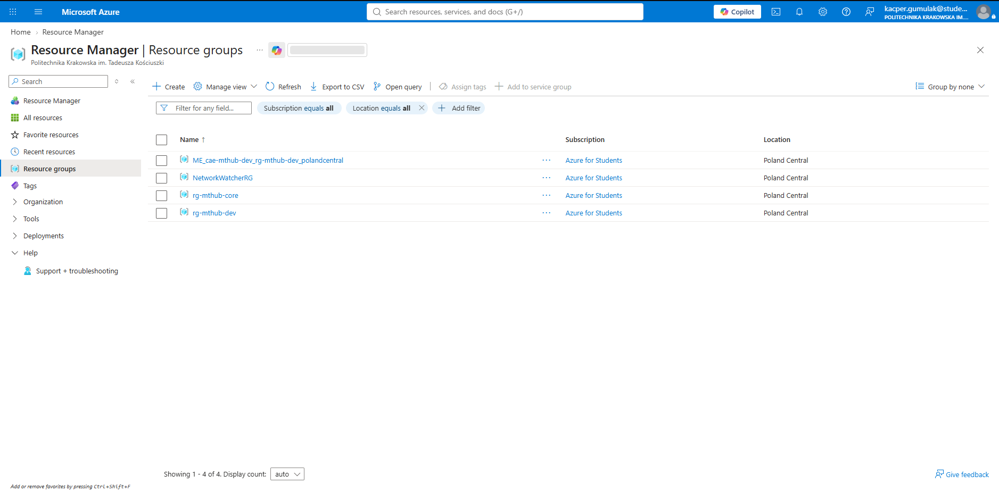

**Provisioned Components Inventory:**
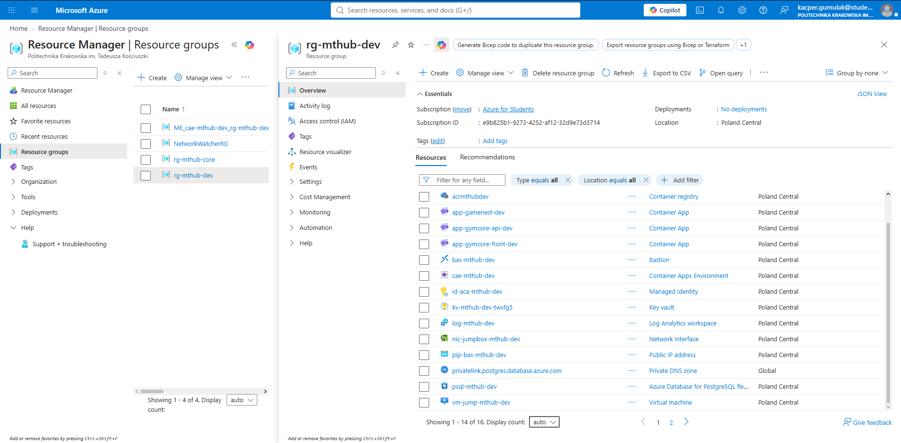

---

### Phase 2: Network Topography & Database Isolation
Security through network isolation is a cornerstone of this project. The Virtual Network (VNET) is strictly segmented, and the persistence layer (PostgreSQL) is entirely cut off from the public internet, accessible only via private endpoints or internal subnets.

**VNET Subnet Segmentation:**
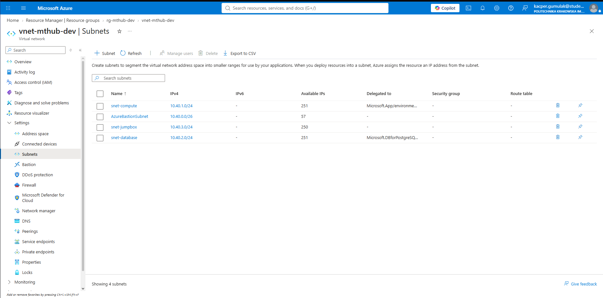

**PostgreSQL Public Access Denial:**
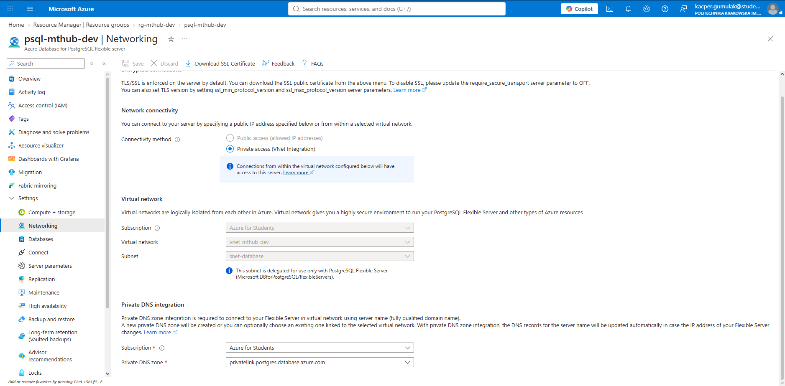

---

### Phase 3: Zero Trust Security & Secrets Management
This phase proves the implementation of the Zero Trust security model. Services authenticate using Managed Identities instead of explicit credentials. The Key Vault acts as a central, encrypted repository for all environment variables and connection strings.

**Role-Based Access Control (AcrPull Assignment):**
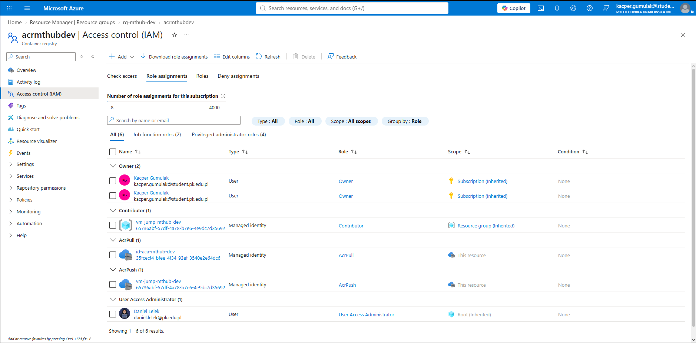

**Key Vault Secrets Storage:**
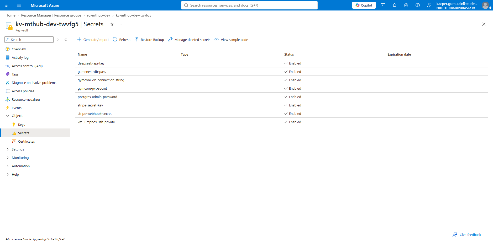

---

### Phase 4: Sidecar Architecture Validation
To solve the PHP execution constraints in a serverless environment, the GameNest application utilizes the Sidecar pattern. This capture explicitly shows both the `nginx` and `php` containers operating concurrently within the same Azure Container Apps replica.

**Container Apps Revisions & Replicas:**
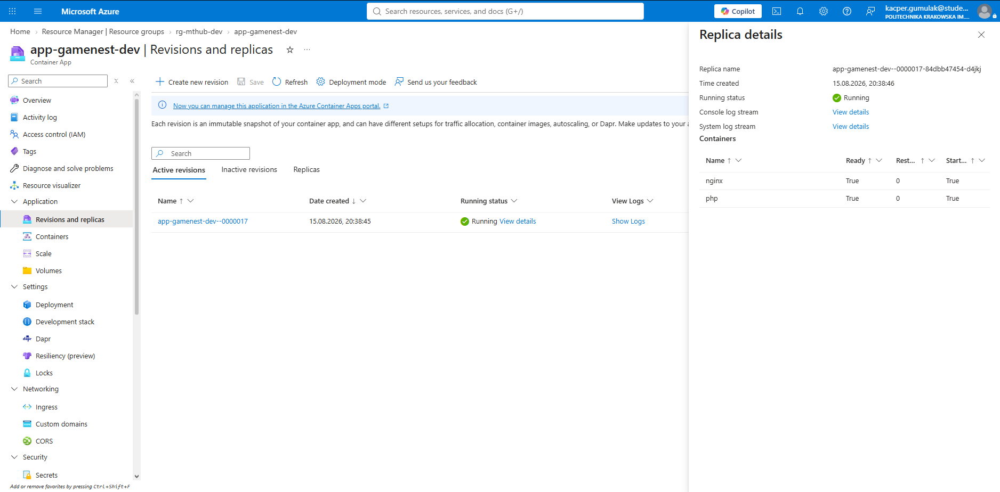

---

### Phase 5: Self-Hosted Runner & CI/CD Pipeline
Continuous Deployment is facilitated by an isolated virtual machine. Access to this machine is secured via Azure Bastion (HTML5 SSH). The runner registers with GitHub Actions and successfully executes the deployment pipeline.

**Secure SSH via Azure Bastion (Jumpbox):**
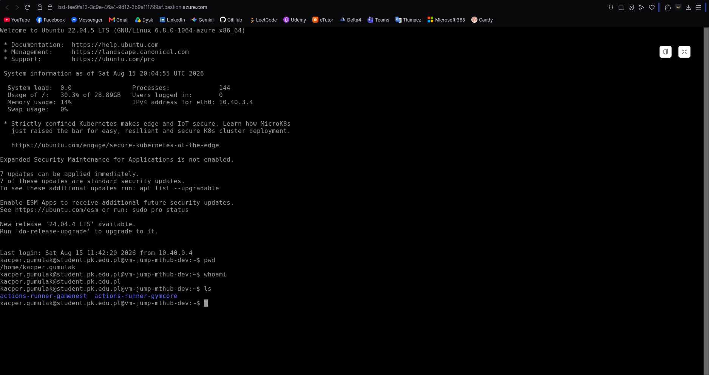

**GitHub Self-Hosted Runner Registration:**
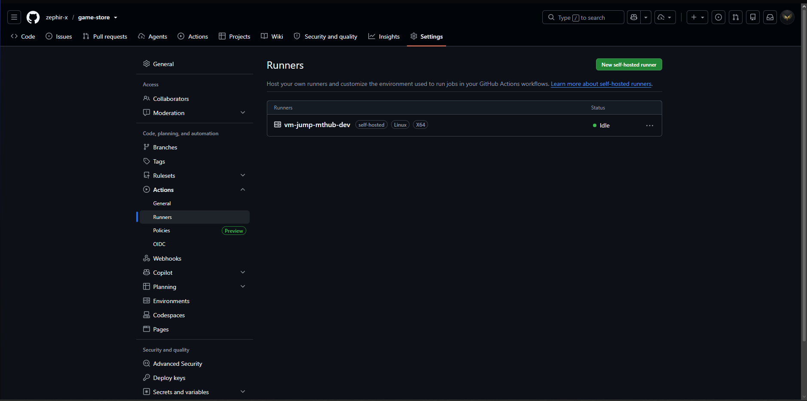

**Successful Pipeline Execution:**
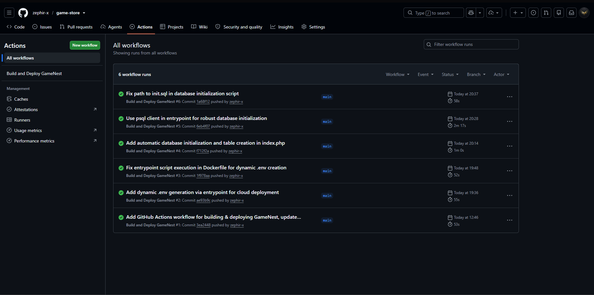

---

### Phase 6: The Final Product (Live Applications)
The ultimate validation of the infrastructure. Both the modern decoupled GymCore application (.NET/React) and the containerized monolithic GameNest application (PHP/NGINX) are fully operational. They are securely exposed via HTTPS on dynamically generated `.azurecontainerapps.io` FQDNs, with successful database connectivity and active routing.

**Live Application - GymCore:**
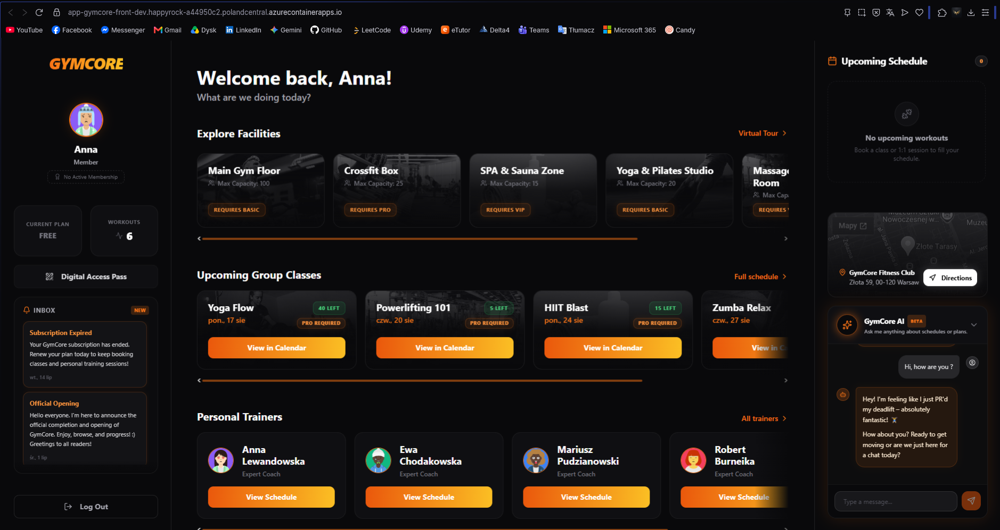

**Live Application - GameNest:**
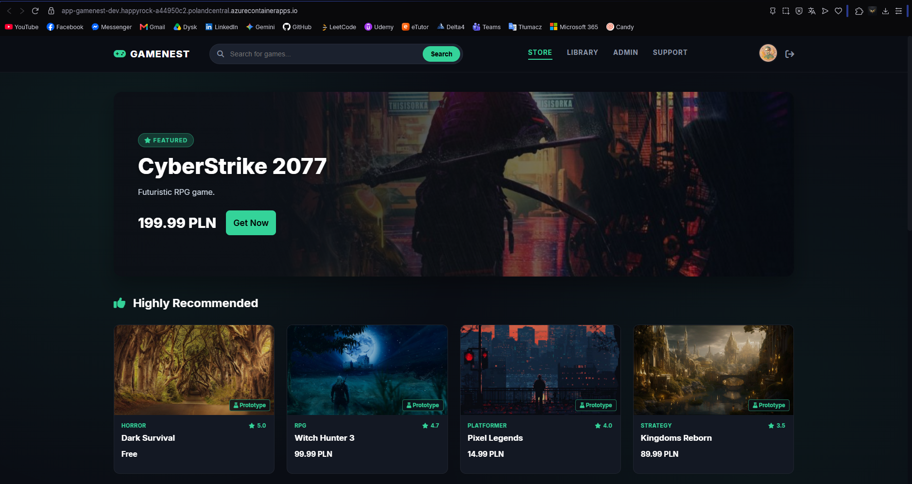

## 7. Environment Lifecycle & Cost Management (FinOps)

**Current Status:**  *Infrastructure Decommissioned (Offline)*

As this project serves as a comprehensive Proof of Concept (PoC) and portfolio showcase, the active Azure environment has been decommissioned via `terraform destroy` following successful validation and testing.

**Cost Analysis & Drivers (~€15 over 3 days):**
Maintaining a fully isolated, production-like environment in the public cloud incurs continuous runtime costs. The primary cost drivers for this specific architecture were:
* **Azure Bastion:** Billed at a continuous hourly rate (approx. €4-€5/day). While it provides enterprise-grade, agentless SSH access without exposing public IPs, it is a significant fixed expense for a 24/7 PoC.
* **Azure Database for PostgreSQL (Flexible Server):** Incurs continuous compute and storage allocation costs.
* **Azure Container Registry & Log Analytics:** Base daily retention and storage fees.

Decommissioning the environment demonstrates responsible cloud resource management (FinOps). Thanks to the robust Terraform automation, the entire infrastructure, along with its CI/CD integrations, can be fully rebuilt and spun up from scratch within 15 minutes whenever required.

*Engineered by Kacper Gumulak* - [zephir-x](https://github.com/zephir-x)  
*Full-Stack & Cloud-Native Infrastructure Development* 